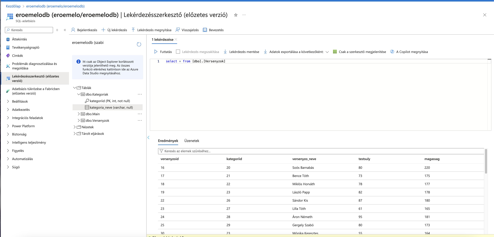
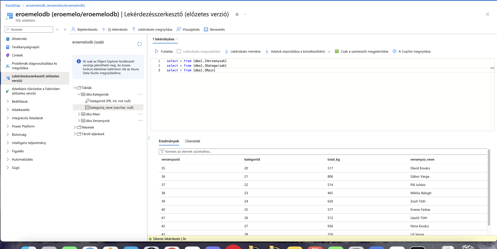

Név: Gimes Szabolcs
Neptunkód: T265WF
### Windows Forms Application

##### User Interface 

- `3x2p` Olyan alkalmazás **elrendezés, melyben gombok lenyomására UserControl-ok kerülnek elhelyezésre egy Panel vezérlőben**, teljesen kitöltve azt. Minden gombra jár a pont, amennyiben az funckuonlalitással rendelkező UserControl-t tölt be. 

- `3x1p` **Többablakos alkalmazás** legalább két felugró ablakkal. Minden Form-nak saját osztályon kell alapulnia, és funcionalitással kell rendelkeznie. Az ablakok nyílhatnak gombokkal vagy felső menüből is.

  

##### Tábla adatainak megjelenítése `ListBox`-ban. 

- `1x2p` Adatok  megjelenítése 
- `2x2p` Ha az adatok tetszőleges módszerrel, pl. `TextBox`-on keresztül szűrhetőek. 
- `1x2p` Ha a tábla adatforrása saját osztály. 

##### Tábla adatainak megjelenítése `DataGridView`-ban 

- `1x2p` Adatok  megjelenítése 

- `1x2p` Ha a tábla adatforrása saját osztály. 

##### Adatkötés `BindingSource` -on keresztül

- `1x2p` Működő  `BindingSource` 
- `3x1p` Egy `BindingSource`-ra egy gyűjemény megjelenítésére alkalmas vezérlő (ListÍBox, ComboBox, DataGridVIew) mellett más adatkötött vezérlő is van kötve, mint `TextBox`, `DateTimePicker`, `ComboBox` idegen kulcs értékének beállítására, stb.

##### Új rekord rögzítése 

A pontok összeadódnak. 

- `2x2p` master-detail reláció detail táblájába ÉS/VAGY több-a-több kapcsolatban álló táblák kapcsolótáblájába
- `1x2p` Ha csak az idegen kulcsok vannak felvéve
- `1x1p` Ha legalább egy nem kulcs mező, pl. _Mennyiség_ is fel van véve
- `1x2p` Ellenőrzéshez kötött adatfelvitel (egyszerű validáció pl: `String.IsNullOrEmpty()`)
- `1x2p` Felugró ablakon keresztül történik _Ok_ és _Mégse_ gombbal
- `1x2p` Ha az űrlap legördülő dobozon vagy listán keresztül beállítható idegen kulcsot is tartalmaz
- `2x1p` A kitöltési hiba `ErrorProvider`-en keresztül kerülnek köközlésre a felhasználóval, hibás kitöltés esetén nem enged rányomni az _Ok_ gombra
- `1x2p` `Regex` alapú validáció
- `1x1p` Hibás kitöltés esetén nem lehet megynomni az _Ok_ gombot. 

##### Saját Adatbázis

SQL script formájában, de legjobb Azure SQL szerveren hosztolni

- `3x1p` Az alkalmazásban használt táblánként pont
- `1x1p` Az adatbázis tartalmaz Constraint-eket (min 2)
- `1x1p` Az adatbázis adatainak forrásmegjelölése értsd: miből készült és hogyan
- `1x2p` Az adatbázis saját Azure SQL szerveren van

### Egyéb, extra

- `2x1p`  `Scaffold-DbContext` használata (ajándék)

### Összesen pontok

53p

 

 

 

 
